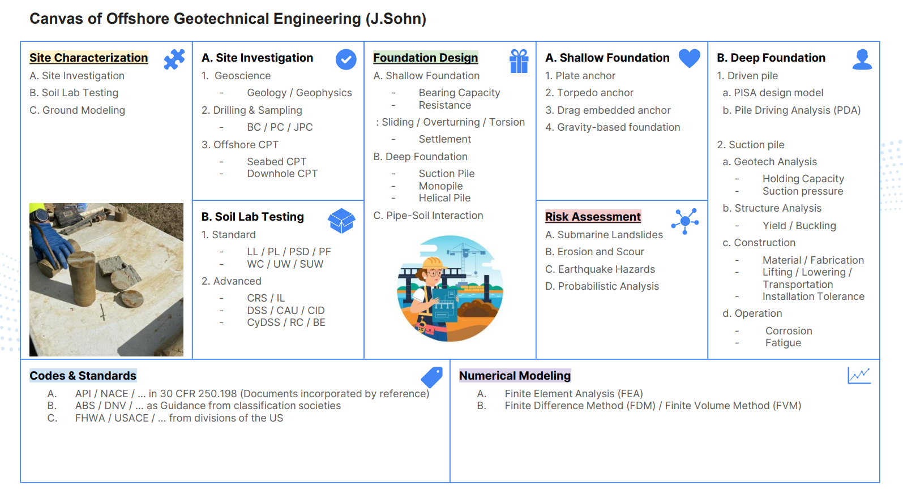

Welcome to GeoSohn
====================

*GeoSohn* is an organized handbook of offshore geotechnical engineering with Python examples.

.. toctree::
   :maxdepth: 1
   :caption: Offshore Geotechnics

   1. Site Investigation <1-Site_Investigation.rst>
   2. Soil Lab Testing <2-Soil_Lab_Testing.rst>
   3. Foundation Design <3-Foundation_Design.rst>
   4. Risk Assessment <4-Risk_Assessment.rst>
   5. Codes and Standards <5-Codes_and_Standards.rst>
   6. Numerical Modeling <6-Numerical_Modeling.rst>
   7. Offshore History <7-Offshore_History.rst>
   
.. toctree::
   :maxdepth: 1
   :caption: Python Applications

   1. MCMC <https://mcmcsoillayerspy-5twn22pprrmtclrnykhwze.streamlit.app/>
   2. BestPractice <>

.. toctree::
   :maxdepth: 1
   :caption: About

   1. Author <https://sites.google.com/view/jungrak-son-phd-pe>
   2. Features <xxx.rst>
